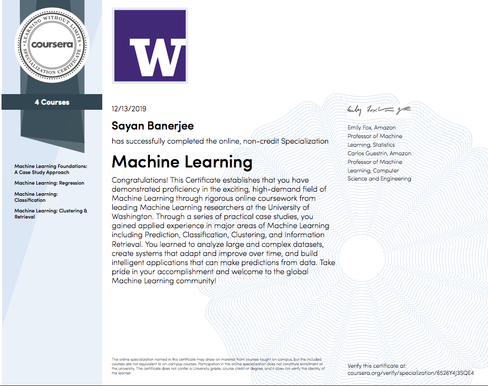

# Machine-Learning-Specialization-University of Washington
Programming Assignments for machine learning specialization courses from University of Washington through Coursera. 

Techniques used: Python, pandas, numpy,scikit-learn, graphlab

In terms of the library and packages, I have only used graphlab and SFrame for Machine Learning Foundations. For almost all the other courses (Regression, Classification and Clustering) I have used pandas for feature enginering and scikit-learn to build out modeling except for one programming assignment in Clustering Retrievel (lda). 

## Specialization Courses:
- Machine Learning Foundations: A Case Study Approach

    Regression: Predicting House Prices (Leverage Zillow data to build linear regression model to predict house prices)

    Classification: Analyzing Sentiment (Build logistic classification model to analyze product sentiment)
    
    Clustering and Similarity: Retrieving Documents (conduct cluster analysis for document retrieval, tf-dif)
    
    Recommending Products: Build Matrix Factorization Model and leverage Jaccard Similarity to Recommend Songs 
    
- Machine Learning: Regression
  
   Project Overview: How to predict a house's price? How to evaluate model? How to prevent model from over-fitting? 

   Simple Linear Regression: Implementing closed-form solution for simple linear regression
   
   Multiple Linear Regression: Exploring multiple regression models for house prediction; Implementing gradient descent for multiple regression
   
   Assessing Performance
   
   Ridge regression
   
   Lasso regression
   
   Kernel regression
   
- Machine Learning: Classification 

  Project 1 Overview: Build classification modeling to predict if an Amazon review is positive. 
  
  Project 2 Overview: Is this loan safe or risky?
  
  In these assignments, I have built logistic regression modeling and decision tree modeling to predict if a loan is risky or safe and test classification errors for different models by both using scikit-learn and implementing the (greedy ascent, greedy decision tree and etc.) algorithm from scratch. 
  
 
  Linear Classifiers & Logistic Regression

  Learning Classifiers; Over-fitting & Regularization in Logistic Regression
  
  Decision Trees
  
  Precision-Recall
  
  Stochastic Gradient Ascent
  
  SVM http://www.svm-tutorial.com/2014/11/svm-understanding-math-part-2/

- Machine Learning: Clustering & Retrieval   
 
  Nearest Neighbor Search
  
  Clustering with K-Means
  
  Mixture Models (Implementing Expectation Maximization Algorithm for Gaussian mixtures; Clustering text data with Gaussian mixtures)
  
  Mixed Membership Modeling via Latent Dirichlet Allocation

## Certificate
